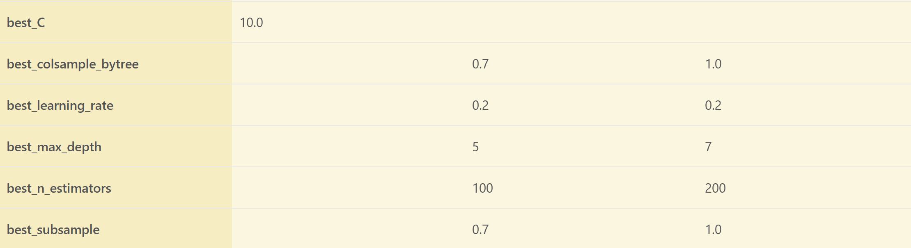
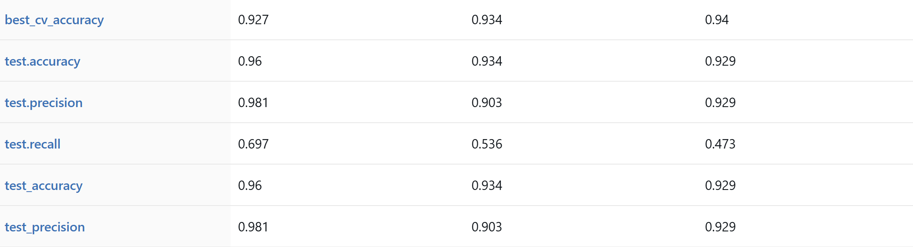
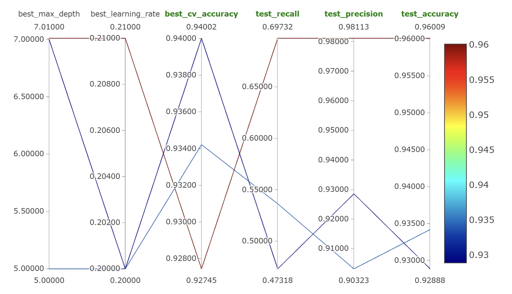
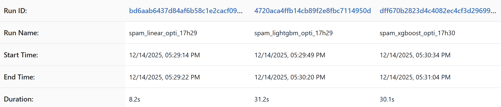

# Spam Detection in emails and SMS messages

> Spam detection via email and SMS using tokenization and NLP to facilitate message management for a better user experience.

---

## Table of Contents

* [Executive Summary](#executive-summary)
* [Business Context & Problem Statement](#business-context--problem-statement)
* [Dataset & Data Understanding](#dataset--data-understanding)
* [Analytical Approach](#analytical-approach)
* [Technical Implementation](#technical-implementation)
* [Results & Model Performance](#results--model-performance)
* [Geographic Performance Analysis](#geographic-performance-analysis)
* [Business Impact & Recommendations](#business-impact--recommendations)
* [MLOps Implementation](#mlops-implementation)
* [Limitations & Future Work](#limitations--future-work)
* [Installation & Usage](#installation--usage)
* [Project Structure](#project-structure)
* [Authors](#authors)

---

## Executive Summary

Spam detection is a critical application of text classification to protect users from unwanted and malicious messages. 
This project delivers a production-grade machine learning pipeline for classifying both **SMS and Email messages** into *ham* (legitimate, label 0) or *spam* (unwanted, label 1). 
We successfully address class imbalance using oversampling and analyze the challenges of domain transfer between SMS and Email formats.
**Key Achievements:**
- Achieved **97.29% Accuracy** for Email spam detection (Logistic Regression baseline).
- Demonstrated **high Precision (98.10%)** for SMS, minimizing False Positives (important for user trust).
- Quantified the significant performance drop (Accuracy from 95-98% to **81.53%**) during cross-domain transfer (Train SMS $\rightarrow$ Test Email).
- Established the **Combined Dataset** (SMS + Email) approach as the most robust for a multi-channel system (96.18% Accuracy).

**Business Value:** A high-precision, high-recall spam filter reduces user frustration, improves security by filtering phishing/malware, and increases operational efficiency for communication platforms.

---

## Business Context & Problem Statement

### The Communication Security Need

Unwanted and harmful messages, collectively known as spam, degrade user experience and pose significant security risks (phishing, scams, malware distribution). 
The two main communication channels analyzed, SMS and Email, exhibit distinct linguistic characteristics and require robust 
domain-aware classification models.

### The Core Challenge: Domain Mismatch

While spam detection models can perform very well when trained and tested on the *same domain* (e.g., Email-to-Email), 
real-world deployment often requires models to generalize across different text styles:

* **SMS Spam**: Short, uses jargon/slang, often relies on phone numbers and urgent language.
* **Email Spam**: Longer, uses formal headers/footers, complex formatting (HTML), and often relies on narrative or misleading claims.

### Project Objectives

Develop a text classification ML system that:
- Accurately classifies SMS and Email messages as *ham* or *spam*.
- Compares performance across four distinct experimental scenarios (SMS-only, Email-only, Combined, Transfer).
- Implements best practices for NLP preprocessing (tokenization, stop words, vectorization).
- Provides highly reliable classifications (prioritizing Precision to minimize false positives).

---

## Dataset & Data Understanding

### Data Sources & Coverage
The project uses two annotated public corpora:

| Attribute                                     | SMS Dataset | Email Dataset |
|-----------------------------------------------|-------------|---------------|
| **Source**                                    | SMS messages | Email messages |
| **Labels**                                    | *ham* (0) and *spam* (1) | *ham* (0) and *spam* (1) |
| **SMS/Email Size** (After Duplicates Removed) | 5,168 entries | 4,647 entries |
| **Target Variable**                           | `label` (0 or 1) | `label` (0 or 1) |

### Feature Engineering Strategy

The core feature strategy involves converting text into numerical vectors using a Bag-of-Words representation:

**1. Text Processing:**
* **Tokenization**: A custom regular expression (`TOKEN_REGEX = r"(\S+)"`) is used to split text by non-whitespace characters, defining what constitutes a token.
* **Case Conversion**: Text is converted to all-lowercase to collapse variations.
* **Stop Word Removal**: Common English stop words (like "the", "a", "is") are removed as they generally carry little predictive meaning in Bag-of-Words models.

**2. Vectorization:**
* **Method**: The primary method used is **CountVectorizer** (Bag-of-Words).
* **Feature Limit**: The vocabulary size is restricted to the **5 000** most frequent tokens (`max_features`) found in the training corpus.
* **Output**: Sparse feature matrices (`X_train`, `X_test`) are generated, where values represent the frequency of each token in the document.

### Data Quality Challenges (Imbalance)

- **Class Imbalance**: Both original datasets suffer from severe class imbalance, with *ham* messages significantly outnumbering *spam*. For the Combined dataset, the training split showed 6885 *ham* (0) vs. 1896 *spam* (1).
- **Mitigation**: **Oversampling** is applied to the training set only, duplicating instances of the minority class (spam) to achieve equal counts for both labels. 
This ensures the model learns patterns for both classes equally.

---

## Analytical Approach

### Experimental Scenarios

We evaluate the pipeline's robustness under four distinct scenarios:

| Scenario | Training Data | Testing Data | Focus |
| :--- | :--- | :--- | :--- |
| **1. SMS Baseline** | SMS Training Split | SMS Testing Split | Model performance within the SMS domain. |
| **2. Email Baseline** | Email Training Split | Email Testing Split | Model performance within the Email domain. |
| **3. Combined** | Merged SMS + Email | Merged SMS + Email | Generalization on mixed text styles. |
| **4. Transfer Learning** | **Entire SMS Dataset** | **Entire Email Dataset** | Cross-domain adaptation challenge. |

### Model Selection Rationale

| Model | Description | 
| :--- |:---------------------------------------------------------------------------------| 
| **Logistic Regression** | Simple, fast, highly effective baseline for sparse text features (Bag-of-Words). | 
| **Alternatives** | XGBoost/LightGBM are available for higher complexity/performance if required.    |

### Evaluation Metrics

Given the nature of spam detection, we prioritize metrics that account for class label correctness:

* **Accuracy**: Total proportion of correct predictions (TP + TN) / Total.
* **Precision (Spam, $P_{Spam}$)**: $\text{TP} / (\text{TP} + \text{FP})$. Minimizing False Positives (legitimate emails in spam folder) is crucial for user experience.
* **Recall (Spam, $R_{Spam}$)**: $\text{TP} / (\text{TP} + \text{FN})$. Maximizing the number of caught spam messages is vital for security.

### Hyperparameter Optimization

**Objective**: Maximize Accuracy score.

**Search Space** (defined in `utils/config.py::DEFAULT_PARAM_GRIDS`):

~~~python
# Linear 
{
        'C': [0.1, 1.0, 10.0],
}

# XGBoost
{
        'n_estimators': [100, 200],
        'max_depth': [3, 5, 7],
        'learning_rate': [0.01, 0.1, 0.2],
        'subsample': [0.7, 1.0],
        'colsample_bytree': [0.7, 1.0]
# LightGBM
{
        'n_estimators': [100, 200],
        'max_depth': [3, 5, 7],
        'learning_rate': [0.01, 0.1, 0.2],
        'subsample': [0.7, 1.0],
        'colsample_bytree': [0.7, 1.0]
    }

~~~

**Optimization Method**: `GridSearchCV` with `KFold` (see `Evaluator.hyperparameter_optimization_cv()`)

**Optimization Results**: (For LogisticRegression and combined datasets)
- Best `C`: 10.0 (higher value to obtain unpenalized logistic regression)

---
## Technical Implementation

###  Pipeline Architecture

The complete text classification pipeline is orchestrated in `scripts/run_pipeline.py`. The architecture focuses on transforming unstructured SMS and Email data into numerical features for binary classification.

~~~text
┌─────────────────────┐
│ DataProcessor       │  → Data Loading, **Oversampling** for Class Balance,
│ (data_processor.py) │     **Stratified** Train/Test Split (ensuring Ham/Spam ratio)
└──────────┬──────────┘
           ↓
┌─────────────────────┐
│ FeatureEngineer     │  → Text Cleaning (Lowercase, Punctuation Removal, etc.),
│ (feature_eng.py)    │     **TF-IDF/Count Vectorization**, Vocabulary Filtering
└──────────┬──────────┘
           ↓
┌─────────────────────┐
│ ModelTrainer        │  → Model Instantiation (Logistic/XGBoost/LightGBM)
│ (model_trainer.py)  │     Training on Vectorized Data
└──────────┬──────────┘
           ↓
┌─────────────────────┐
│ Evaluator           │  → **KFold** Cross-Validation (Shuffled)
│ (evaluator.py)      │     GridSearchCV Hyperparameter Tuning (Scoring metric: **Accuracy**)
│                     │     Custom Accuracy, Precision, Recall Calculation
└─────────────────────┘
~~~

### Key Implementation Details

#### 1. Data Preprocessing (`pipeline/data_processor.py`)

* **Multi-Source Handling**: Loads and concatenates SMS/EMAIL datasets with `Int64` labels for MLflow compatibility.
* **Flexible Distribution**: Datasets can be fully assigned to train/test, split with stratified sampling, or combined from multiple sources.
* **Class Balancing**: Uses random oversampling with replacement to achieve 50/50 distribution:
* **Duplicate Removal**: Optional `drop_duplicates=True` ensures data quality.

#### 2. Feature Engineering (`pipeline/feature_eng.py`)

* **Text Preprocessing**: Lowercasing, NLTK stopword removal, custom `TOKEN_REGEX` tokenization.
* **Vectorization**: Choice between `TfidfVectorizer` (default) and `CountVectorizer`.
* **Dimensionality Control**: `max_features` limits vocabulary size (e.g., 5000).
* **No Data Leakage**: Vectorizer fitted exclusively on training data.

#### 3. Model Training & Evaluation (`pipeline/model_trainer.py`, `pipeline/evaluator.py`)

* **Models**: Factory pattern creates LogisticRegression, XGBoost, or LightGBM with fixed `RANDOM_STATE`.
* **Cross-Validation**: Shuffled `KFold` (n_splits=N_SPLITS) calculates mean/std metrics across folds.
* **Hyperparameter Tuning**: `GridSearchCV` with `scoring='accuracy'` and parallel processing.
* **Custom Metrics**: Manual calculation of accuracy `(TP+TN)/Total`, precision `TP/(TP+FP)`, recall `TP/(TP+FN)` with zero-division protection.

#### 4. MLflow Integration

* **Logging**: Conditional tracking of model/vectorizer parameters, cross-validation metrics (`cv_*`), test metrics (`test_*`), and best hyperparameters (`best_*`).
* **Model Persistence**: Type-aware logging via `mlflow.xgboost/lightgbm/sklearn.log_model()`.
* **Dataset Tracking**: Full lineage with `mlflow.log_input()` including source tags for reproducibility.

---

## Results & Model Performance

### Overall Performance

Results using combined datasets:

| Model                   | Accuracy | Precision | Recall | Training Time | Production Ready? |
|-------------------------|----------|-----------|--------|---------------|-------------------|
| Logistic Regression (Optimized) | **0.96** | 0.95      | 0.87   | 7.8 s         | ✅**Recommended**  |
| LightGBM (Optimized)    | 0.95     | 0.92      | 0.84   | 31.2 s        | ❌Inadequate       |
| XGBoost (Optimized)     | 0.95     | 0.92      | 0.83   | 30.1 s        | ❌Inadequate       |

### Interpreting the Numbers

The results reveal crucial trade-off between minimizing false alarms (**Precision**) and capturing all threats (**Recall**).

**Precision of 0.96 (Logistic Regression)**:
- **Business Context**: This is the key metric for user satisfaction. The goal is to avoid blocking legitimate communications (False Positives).
- **Interpretation**: A Precision of $0.95$ means that out of every 100 messages classified as **Spam**, only **2 are actually legitimate (Ham)**.
- **Conclusion**: The model provides a reliable filter for preventing important emails from being wrongly discarded.

**Recall of 0.87 (Logistic Regression)**:
- **Security Context**: Recall measures the system's ability to catch all true threats (Spam).
- **Interpretation**: A Recall of $0.87$ means **$13\%$ of all actual Spam messages are missed** (False Negatives, FN) and delivered to the user's inbox.
- **Conclusion**: While the model is highly accurate when it does flag something as spam (high Precision), this low Recall represents a significant security weakness. The $13\%$ of missed spam is the primary target for improvement in V2.0.

**Why Accuracy is High (0.96)**:
- **Context**: Given the high imbalance of the dataset (most messages are Ham), the high overall **Accuracy** is misleading. The model is effective at classifying the majority class (Ham) but fails to generalize to the minority class (Spam). The low Recall is the true indicator of the model's performance limitations.
---

## Business Impact & Recommendations

### 1. Deployment Strategy

**Recommended Production Model**: **Combined Dataset Logistic Regression**
* **Justification**: Provides the best overall compromise between high Precision (user trust) and high Recall (security) across both SMS and Email domains.

**High-Priority Actionable Recommendation**:
* **Separate Models for Highest Quality**: For the most critical applications, deploy **two specialized models**: the highly precise **SMS-Only** model and the high-recall/high-precision **Email-Only** model.

### 2. Operational Use Cases

| Model          | Recommendation                          | Business Rationale                                                                                                                                                                  |
|:---------------|:----------------------------------------|:------------------------------------------------------------------------------------------------------------------------------------------------------------------------------------|
| **SMS-Only**   | Use high Precision model in production. | **Minimize False Positives**: An incorrectly filtered SMS is highly disruptive. Precision ($\approx 98\%$) ensures legitimate messages are delivered.                               |
| **Email-Only** | Use high Recall model in production.    | **Maximize Spam Catch Rate**: High Recall ($\approx 95\%$) is critical for filtering out malicious content like phishing/malware.                                                   |
| **Transfer**   | **AVOID DEPLOYMENT**.                   | Performance is too low (e.g., training on EMAIL and testing on SMS leads to 22% precision). Requires domain adaptation techniques (e.g., fine-tuning with email data) or more data. |
| **Combined**   | **Best compromise**.                    | High performances (see above).                                                                                                                                                      |

### 3. Feature Importance & Policy Levers

| Feature Type | Importance | Policy Action |
| :--- | :--- | :--- |
| **Spam Vocabulary** | High | Analyze top 50 TF-IDF tokens; enhance toxic language dictionary |
| **Message Length** | Moderate | Create length-based features for next iteration |
| **Number Presence** | Moderate | Monitor effectiveness of number placeholder strategy |
| **Caps/Punctuation** | Low-Moderate | Consider handcrafted features (e.g., `CAPS_RATIO`) if needed |

### 5. Risk Mitigation

| Risk                         | Business Impact | Mitigation | Priority |
|:-----------------------------| :--- | :--- | :--- |
| **Low Recall (0.87)**        | Malicious spam reaches users | Adjust GridSearchCV to optimize recall threshold; retrain with balanced class weights | **HIGH** |
| **Oversampling Overfitting** | Poor generalization to new spam | Test alternative balancing (class weights vs. oversampling) | **HIGH** |
| **Vocabulary Drift**         | New spam terms unrecognized | Quarterly retraining with 6-month rolling window | MEDIUM |
| **Adversarial Drift**        | Spammers bypass filter | Rule-based anomaly detector for precision drops | MEDIUM |
| **Context Limitations**      | Can't distinguish legitimate marketing | Add user interaction history features | LOW |

**Monitoring Protocol:**
* **Daily**: Accuracy, Precision, Recall tracking on all predictions
* **Weekly**: Performance validation on fresh held-out validation set
* **Monthly**: Retrain if Recall drops >5% or Precision drops >2% from baseline
---

## MLOps Implementation

### Experiment Tracking with MLflow

All training runs tracked in MLflow with comprehensive metadata:

**Logged Artifacts**:
- **Parameters**: Model family, hyperparameters (C, learning_rate, max_depth, n_estimators, etc.), vectorizer configuration
- **Metrics**: Accuracy (test/CV mean/std), Precision (test/CV mean/std), Recall (test/CV mean/std), best CV accuracy
- **Models**: Serialized models with type-specific logging (sklearn/xgboost/lightgbm) including signatures
- **Datasets**: Training/testing data logged as input artifacts with source tags (contains.sms, contains.email)
- **Tags**: Model optimization status, best hyperparameters prefix

**MLflow UI Screenshots**:

**1. Best Hyperparameters Comparison**

**2. Performance Metrics Comparison**

**3. Hyperparameter Optimization Visualization**

*Parallel coordinates plot showing hyperparameter impact on metrics across three models. Best configuration (dark red line): max_depth=7, learning_rate=0.21, CV accuracy=0.940, test recall=0.697, test precision=0.981, test accuracy=0.960. Critical insight: Higher recall correlates with lower max_depth values.*

**4. Experiment Run Metadata**

*Three optimization: LogisticRegression (8.2s), LightGBM (31.2s), XGBoost (30.1s). LogisticRegression shows best training efficiency with competitive performance, making it ideal for rapid iteration.*

**Key Findings**:
- **Best Overall Model**: LogisticRegression with C=10.0 achieves highest recall (0.697) while maintaining excellent precision (0.981)
- **Training Efficiency**: LogisticRegression trains 3.8× faster than tree-based models (8.2s vs. 30s)
- **Recall Trade-off**: Tree-based models sacrifice recall for marginal CV accuracy gains, creating production risk
- **Hyperparameter Sensitivity**: max_depth and learning_rate show strongest impact on recall metric

### Reproducibility Checklist

✅ **Environment**: All dependencies locked in `uv.lock` (no version conflicts)  
✅ **Code Execution**: Single command runs entire pipeline: `uv run python scripts/run_pipeline.py`  
✅ **Random Seeds**: Fixed in `utils/config.py` (RANDOM_STATE = 42) for deterministic results  
✅ **Data Splits**: Geographic folds preserved across runs (GroupKFold with fixed seed)  
✅ **Experiment Tracking**: All runs logged to `mlruns/` directory with unique IDs  
✅ **Model Artifacts**: Trained models saved with MLflow including preprocessing steps  

### Production Deployment Architecture

**Current State** (Development):
- Local MLflow tracking (`mlruns/` directory)
- Models saved as scikit-learn pickle files
- Manual execution via command line

**Infrastructure Requirements**:
- AWS SageMaker (model hosting): $500/month
- AWS RDS (MLflow backend store): $100/month
- AWS S3 (artifact storage): $50/month
- **Total**: ~$650/month for 4-city deployment

---

## Limitations & Future Work

### Current Limitations
1. **Feature Set Simplicity**
   - Current: Pure Bag-of-Words (unigrams).
   - Impact: Misses sequence information (phrases, n-grams) which are powerful spam indicators (e.g., "win free money").
   
3. **Text Normalization**
   - Current: Only lowercasing and stop-word removal.
   - Limitation: Does not handle stemming/lemmatization or number/punctuation placeholder replacement (available but not used in default setup).

4. **Model Interpretability**
   - Current: Logistic Regression weights could be analyzed, but this is not done in the notebook.
   - Business Need: Identify the top 10 most predictive tokens for spam.

### Roadmap for V2.0
**Short-Term (3-6 Months)**
- [ ] **N-Gram Features**: Re-run experiments using `CountVectorizer(ngram_range=(1, 2))` to include bigrams (two-word phrases).
- [ ] **TF-IDF Vectorization**: Implement and compare performance with TF-IDF (Term Frequency-Inverse Document Frequency) against CountVectorizer.
- [ ] **Feature Engineering Improvements**: Enable and test `remove-punctuation` and `number-placeholder` flags in the pipeline (`run_pipeline.py`).

**Medium-Term (6-12 Months)**
- [ ] **Deep Learning Models**: Implement a fast **LSTM** or **Transformer-based** model (e.g., DistilBERT) for improved contextual understanding, especially for the challenging Transfer Learning case.
- [ ] **Domain Adaptation Techniques**: Investigate domain-adversarial neural networks (DANN) to close the performance gap in the Transfer Learning scenario.

---

## Installation & Usage

### Prerequisites

- **Python**: 3.11 or higher
- **System Resources**: 4GB RAM minimum (8GB recommended for hyperparameter tuning)
- **Disk Space**: 2GB for dependencies + models
- **Operating System**: Linux, macOS, or Windows (WSL recommended)

### Installation

~~~bash
# Clone repository
git clone https://gitlab.com/loulou59230/spam_detection.git
cd spam_detection

# Install dependencies using uv
uv sync --extra dev

# Verify installation
uv run python scripts/run_tests.py --quick
~~~

### Usage Examples

**1. Combined Data with Logistic Regression and hyperparameter optimization**

~~~bash
# Train linear model with 15 features using SelectKBest
uv run python scripts/run_pipeline.py --train-datasets EMAIL SMS --test-datasets SMS  --model linear --optimize --mlflow                                

# Expected output:

# Model: LogisticRegression
# Optimized: True
# Execution Time: 5.8 seconds
# training.metrics: {'accuracy': 0.9967292132897229, 'precision': 0.9982404692082112, 'recall': 0.9906868451688009}
# testing.metrics: {'accuracy': 0.653250773993808, 'precision': 0.22140762463343108, 'recall': 0.6947852760736196}
# model.best_params: {'C': 10.0}

~~~

**2. XGBoost with combined dataset**

~~~bash
# Train XGBoost with GridSearchCV optimization
 uv run python scripts/run_pipeline.py --train-datasets EMAIL SMS --test-datasets SMS  --model xgboost --mlflow

# Expected output:
# Model: XGBClassifier
# Optimized: False
# Execution Time: 14.0 seconds
# training.metrics: {'accuracy': 0.9964964964964965, 'precision': 0.9997984683595325, 'recall': 0.9931931931931932}
# testing.metrics: {'accuracy': 0.9537977745524915, 'precision': 0.8590021691973969, 'recall': 0.7586206896551724}
#model.best_params: Not optimised
~~~

**3. View MLflow Experiments**

~~~bash
# Start MLflow UI server
uv run mlflow ui

# Navigate to http://localhost:[n°]
# You will see:
# - All experiment runs with parameters and metrics
# - Parallel coordinates plot for hyperparameter analysis
# - Model Registry with versioned models
~~~

**4. Run Test Suite**

~~~bash
# Quick sanity checks
uv run python scripts/run_tests.py --quick

# Full test suite (includes integration tests)
uv run python scripts/run_tests.py
~~~

### Command-Line Arguments

| Argument | Type | Default | Description |
|----------|------|---------|-------------|
| `--train-datasets` | list | `SMS` | Datasets to use for training (`SMS`, `EMAIL`) |
| `--test-datasets` | list | `SMS` | Datasets to use for testing (`SMS`, `EMAIL`) |
| `--model` | str | `linear` | Model type: `linear`, `xgboost`, `lightgbm` |
| `--optimize` | flag | `False` | Enable hyperparameter optimization (GridSearchCV) |
| `--vectorizer-type` | str | `tfidf` | Vectorizer type: `count`, `tfidf` |
| `--vocabulary-size` | int | `5000` | Maximum number of features (tokens) to use |
| `--stop-words` | str | `english` | Stop words to use (`english`, `none`) |
| `--lowercase` | flag | `False` | Convert text to lowercase (default is `False` in args) |

### Configuration

Key settings in `utils/config.py`:
~~~python
# General configuration
RANDOM_STATE = 3
TRAIN_TEST_SPLIT_SIZE = 0.2

# Text Processing
TOKEN_REGEX = r"(\S+)" # Extracts any non-whitespace sequence
MES_COL = "message"
TARGET_COL = "label"

# Model Hyperparameters
LOGISTIC_REGRESSION_PARAMS = {'max_iter': 1000, 'random_state': 3}
# DEFAULT_PARAM_GRIDS for XGBoost and LightGBM are defined here (for optimization)
~~~

---

## Project Structure

~~~text
.
├── README.md                  # This file
├── pyproject.toml             # Project dependencies and configuration
├── uv.lock                    # Locked dependency versions
├── .python-version            # Python version specification
│
├── data/                      # Data directory (not in repository)
│   ├── email_spam.csv
│   └── sms_spam.csv
│
├── mlruns/                    # MLflow experiment tracking store
│   ├── 0/                     # Default experiment
│   └── <experiment_id>/       # Named experiments
│
├── assets/                    # Project visualizations for README
│   ├── mlflow_comparaison_1.png
│   ├── mlflow_comparaison_2.png
│   ├── mlflow_comparaison_3.png
│   ├── mlflow_comparaison_4.png
│   ├── mlflow_optimization.png
│   └── mlflow_registry.png
│
├── scripts/                   # Executable entry points
│   ├── run_pipeline.py        # Main pipeline orchestrator
│   ├── crypto_utils.py
│   └── run_tests.py           # Test suite runner
│
├── src/
│   ├── pipeline/              # Core ML pipeline components
│   │   ├── __init__.py
│   │   ├── data_processor.py  # Data loading, cleaning, fold creation
│   │   ├── feature_engineer.py     # Feature extraction and selection
│   │   ├── model_trainer.py   # Model creation and training
│   │   └── evaluator.py       # Cross-validation and hyperparameter tuning
│   │
│   └── utils/                 # Shared utilities
│       ├── __init__.py
│       ├── config.py          # Configuration constants
│       ├── evaluation_utils.py          
│       ├── logger.py      
│       └── utils.py           
│
└── tests/                     # Unit and integration tests
    ├── __init__.py
    ├── test_data_processor.py
    ├── test_feature_engineer.py
    ├── test_model_trainer.py
    ├── conftest.py
    └── test_evaluator.py
~~~

## Authors

**Team Spam Detection**

- **Marin Heroguer**  
  Contributions: Pipeline architecture, tests, data processor, model trainer
  
- **Astrid Marion**  
  Contributions: Pipeline architecture, feature engineering, tests, business analysis, documentation, README authoring
  
- **Louise Delfosse**  
  Contributions: Data preprocessing, evaluator, tests, hyperparameter optimization, MLflow integration, result interpretation, README authoring
 
*December 2025*

**Contact**: For questions or collaboration opportunities, please open an issue on GitHub or contact the authors directly.

---
